# Git в VS Code: разбор со скриншотами

Практический разбор: как работать с git и GitHub через панель Source Control,
без заучивания команд. Каждый шаг — что нажимаем, что при этом происходит
и как та же операция выглядит в терминале.

Скриншоты сделаны в VS Code на macOS. На Windows подписи те же, отличается
только оформление окна.

> Нужен разбор подробнее, шаг за шагом и со всеми экранами? Есть
> [полная версия](FULL.md) — все 131 скриншот в порядке выполнения.

## Содержание

1. [Подготовка: VS Code и свой аккаунт GitHub](#1-подготовка)
2. [Первый репозиторий: склонировать или создать](#2-первый-репозиторий)
3. [Изменения и коммиты](#3-изменения-и-коммиты)
4. [История и граф коммитов](#4-история-и-граф-коммитов)
5. [Ветки: создать, переключиться, слить, удалить](#5-ветки)
6. [Ветки на GitHub и Pull Request](#6-ветки-на-github-и-pull-request)
7. [Конфликты и как их разрешать](#7-конфликты)
8. [Совместная работа: pull и fetch](#8-совместная-работа-pull-и-fetch)
9. [Служебные файлы: .gitignore, .gitkeep, README](#9-служебные-файлы)
10. [Коммиты с помощью ИИ](#10-коммиты-с-помощью-ии)
11. [Шпаргалка: кнопка ↔ команда](#шпаргалка-кнопка--команда)

---

## 1. Подготовка

### Зачем вообще git

Пока проект маленький, кажется, что достаточно папки с файлами. Проблемы
начинаются позже: «а как было неделю назад», «кто это сломал», «у меня
работает, у тебя нет», «мы вдвоём правили один файл». Git отвечает на все
четыре вопроса, потому что хранит **историю снимков** проекта, а не только
последнюю версию.

GitHub — это сайт, куда эту историю можно выложить, чтобы она была доступна
с любого компьютера и другим людям. Git работает и без интернета; GitHub без
git не нужен.

### Работаем в своём аккаунте

Если за компьютером до вас сидел другой студент, VS Code помнит его аккаунт —
и ваши коммиты уйдут от его имени. Прежде чем начинать:

1. Значок человечка внизу слева → **Sign out**, если там чужое имя.

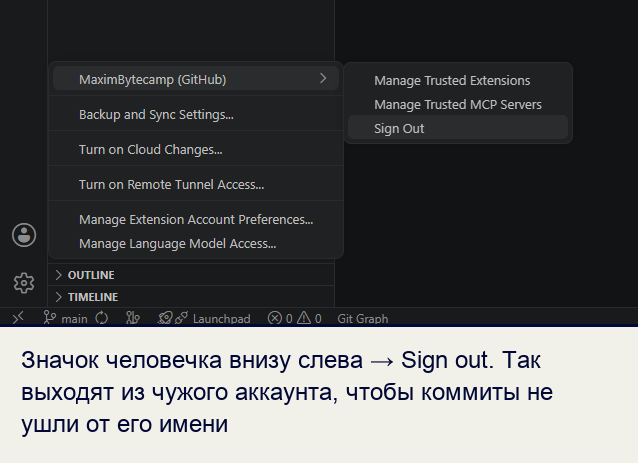

2. Тот же значок → **Sign in to GitHub** → браузер → **Authorize**.

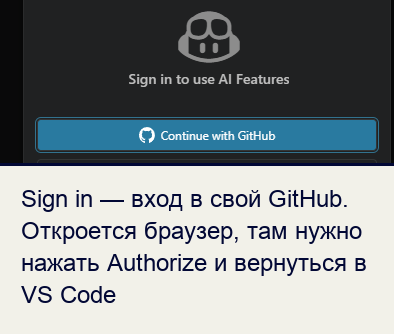

3. Возвращаетесь в VS Code и проверяете, что внизу стоит ваше имя.

### Панель, в которой всё происходит

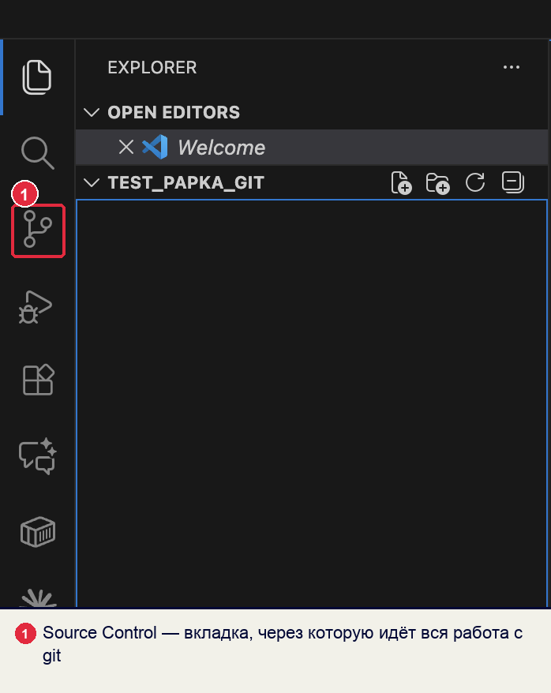

Открывается сочетанием <kbd>Cmd/Ctrl</kbd> + <kbd>Shift</kbd> + <kbd>G</kbd>.
Дальше почти всё будет происходить здесь.

### Представиться git

Git подписывает каждый коммит именем и почтой. Если их не задать, коммит
не создастся, а VS Code покажет ошибку. Один раз выполните в терминале
(<kbd>Ctrl</kbd> + <kbd>~</kbd>):

```bash
git config --global user.name "Иван Иванов"
git config --global user.email "почта, привязанная к GitHub"
```

Почта должна совпадать с той, что на GitHub, — иначе коммиты не свяжутся
с вашим профилем и не попадут в статистику.

---

## 2. Первый репозиторий

Есть два начала: забрать готовый проект или начать свой.

### Склонировать чужой проект

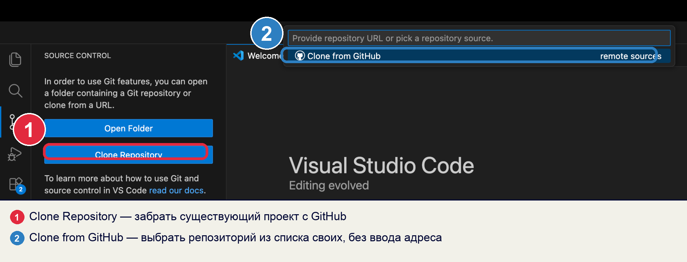

**Clone Repository** спросит адрес. Можно вставить ссылку вида
`https://github.com/user/repo.git`, а можно выбрать **Clone from GitHub** —
тогда VS Code покажет список ваших репозиториев, и адрес вводить не нужно.

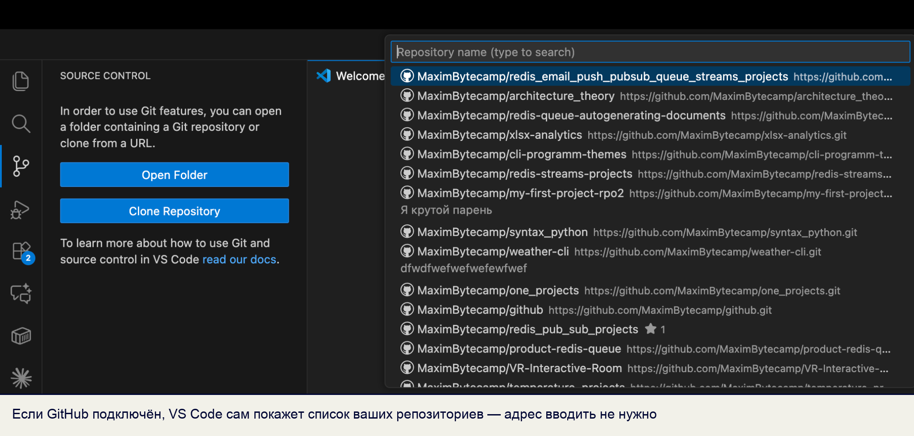

Дальше выбираете папку на компьютере, куда положить копию. Git скачает
не только файлы, но и всю историю проекта.

> В терминале: `git clone https://github.com/user/repo.git`

### Начать свой

Открываете пустую папку (**File → Open Folder**) и заходите в Source Control:

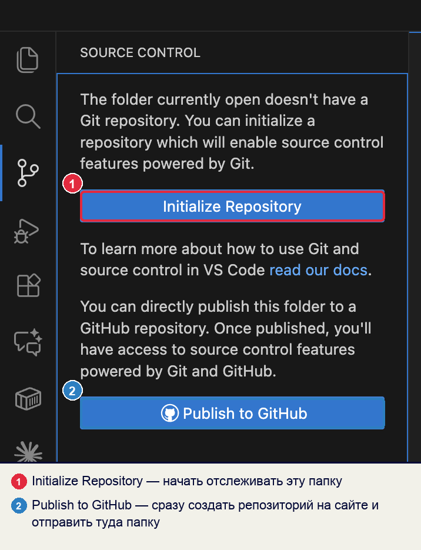

**Initialize Repository** создаёт внутри папки скрытый каталог `.git` —
с этого момента git следит за изменениями. Внешне ничего не меняется,
файлы остаются на месте.

**Publish to GitHub** делает то же самое и сразу заводит репозиторий
на сайте: VS Code спросит имя и попросит выбрать, публичным он будет или
приватным.

> В терминале: `git init`

---

## 3. Изменения и коммиты

Создайте пару файлов — и панель оживёт.

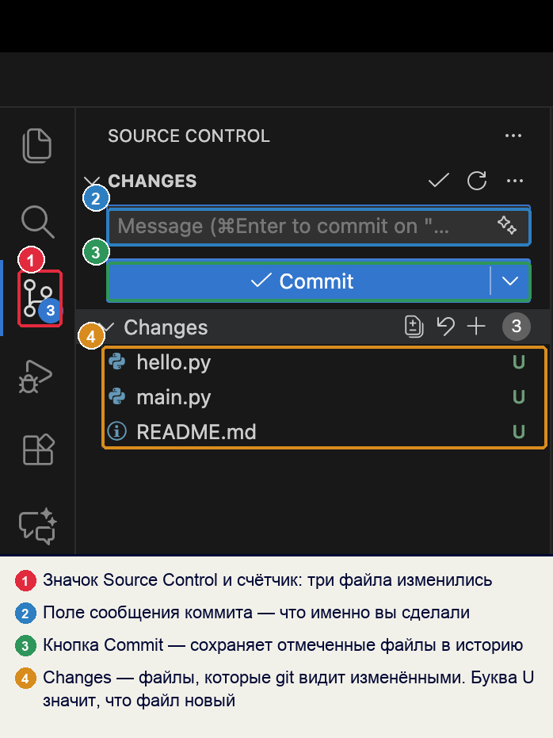

Каждый файл помечен буквой:

| Буква | Что значит |
|---|---|
| `U` | untracked — новый файл, git его раньше не видел |
| `M` | modified — файл был и изменился |
| `D` | deleted — файл удалён |

### Два шага вместо одного

Git не сохраняет всё подряд: сначала вы **отбираете**, что войдёт в снимок,
и только потом делаете снимок. Это позволяет закоммитить одну часть работы,
а вторую оставить на потом.

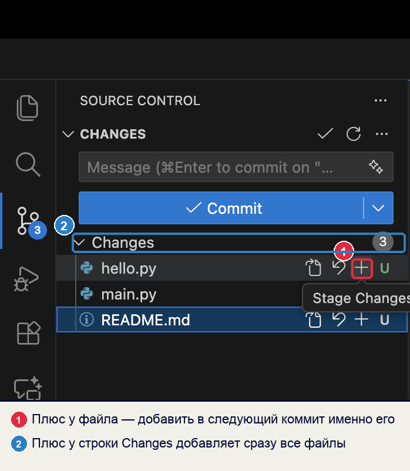

Отобранные файлы переезжают в раздел **Staged Changes** — это и есть
«корзина» будущего коммита.

> В терминале: `git add hello.py` — один файл, `git add .` — все сразу

### Коммит

Пишете в поле сообщение и нажимаете **Commit**. Сообщение — не формальность:
через месяц по списку коммитов вы будете искать, где что сломалось.

```
плохо                     хорошо
fix                       hw-01: разбор знакомого сервиса
update                    lesson_07: максимум за один проход
изменения                 fix: пустой список больше не роняет /orders
```

> В терминале: `git commit -m "hw-01: разбор знакомого сервиса"`

### Если коммит не создаётся

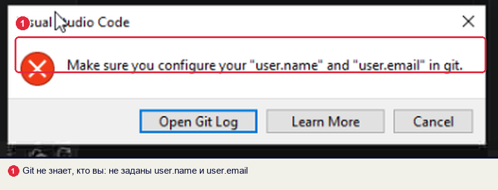

Вернитесь к разделу 1 и выполните две команды `git config`. После этого
коммит пройдёт — переделывать ничего не нужно.

### Отправить на GitHub

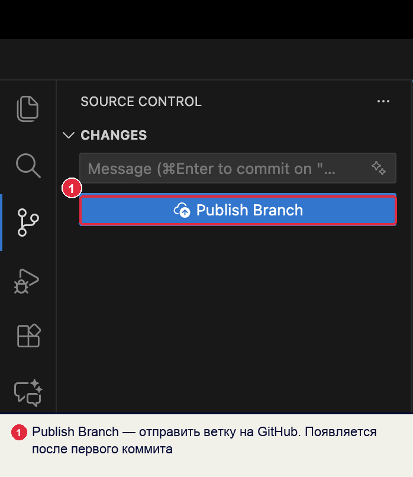

После первого коммита на месте кнопки Commit появляется **Publish Branch**.
Она создаёт ветку на GitHub и отправляет туда ваши коммиты. Дальше на её
месте будет **Sync Changes** — она и отправляет ваше, и забирает чужое.

Если репозитория на GitHub ещё нет, VS Code спросит имя и видимость:

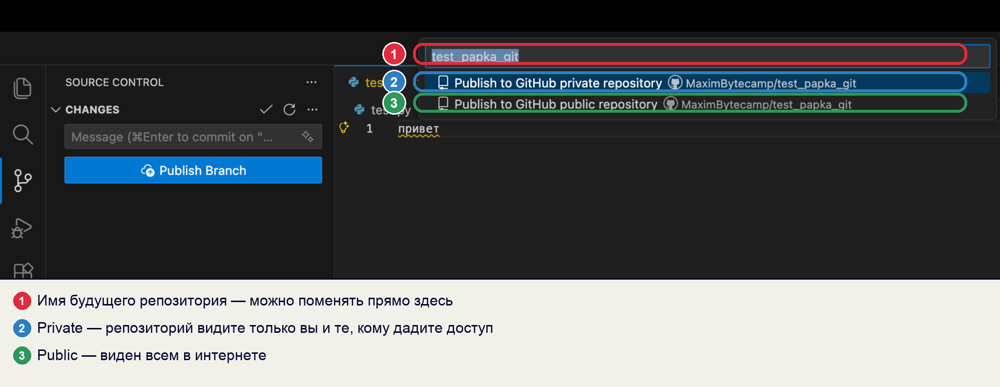

**Private** — видите только вы и те, кому дадите доступ. **Public** — виден
всем. Для учебных работ обычно берут private, а ссылку выдают преподавателю.

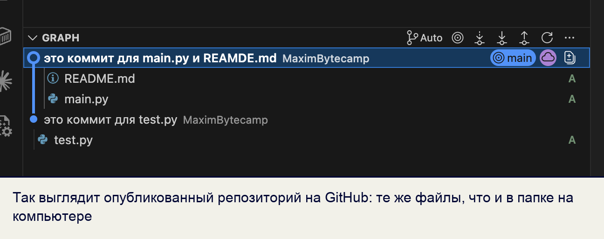

> В терминале: `git push -u origin main`

**Важно.** Пока вы не нажали Publish, на GitHub нет ничего: коммиты лежат
только на вашем компьютере. Git и GitHub — разные вещи.

---

## 4. История и граф коммитов

Каждый коммит — снимок проекта в определённый момент. История показывает,
что и когда менялось, а граф — как ветки расходились и сходились.

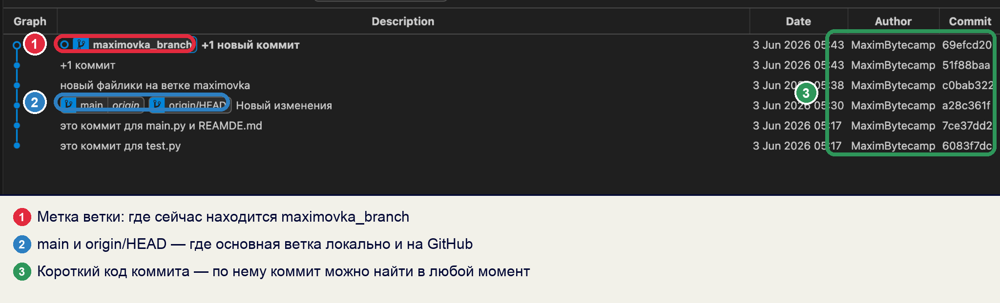

Читается снизу вверх: внизу самые старые коммиты, вверху — свежие. Цветные
метки показывают, где сейчас **находится** каждая ветка:

- `main` — ваша основная ветка на компьютере;
- `origin/main` и `origin/HEAD` — та же ветка, но на GitHub. Если метки
  разъехались, значит у вас есть коммиты, которых нет на сайте, или наоборот;
- короткий код вида `a28c361` — адрес коммита. По нему коммит находят
  и на него ссылаются.

Клик по коммиту показывает, какие файлы в него вошли; клик по файлу —
что именно в нём изменилось: слева было, справа стало.

**Удалить коммит после публикации нельзя** — можно только сделать новый,
который отменяет изменения. История это дорога в одну сторону.

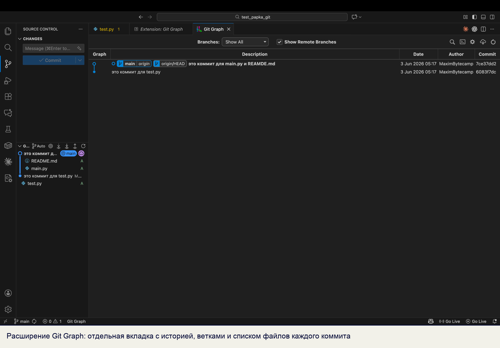

> Смотреть историю удобнее с расширением **Git Graph**: устанавливается
> в Extensions, после чего внизу появляется отдельная вкладка.

> В терминале: `git log --oneline --graph`

---

## 5. Ветки

Ветка — отдельная линия работы. Вы копируете текущее состояние проекта,
меняете что хотите, и на основной версии это никак не отражается, пока вы
сами не сольёте изменения. Не получилось — ветку просто удаляют.

Правило: **в `main` лежит рабочая версия**, эксперименты и новые функции
живут в отдельных ветках.

### Создать и переключиться

Имя текущей ветки всегда видно в статус-баре слева внизу. Клик по нему
открывает меню:

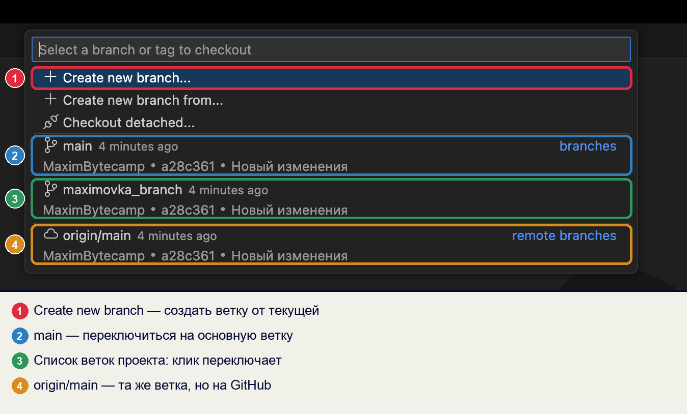

После создания имя в статус-баре меняется — вы уже в новой ветке. Всё, что
вы теперь коммитите, попадает в неё.

> В терминале: `git switch -c имя-ветки`, переключиться обратно —
> `git switch main`

### Проверьте, что ветки правда независимы

Создайте на новой ветке пару файлов, закоммитьте, переключитесь на `main` —
и файлы исчезнут из папки.

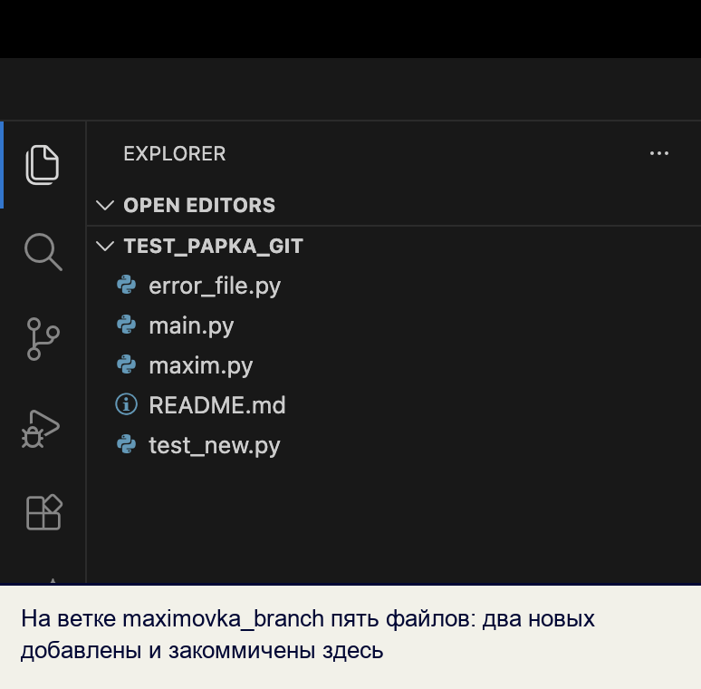

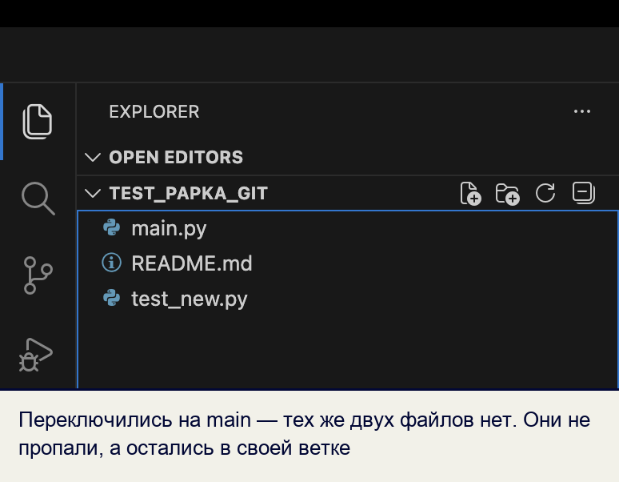

Это не потеря: они лежат в своей ветке. Вернитесь обратно, и они появятся
снова. Пока это не увидишь своими глазами, ветки кажутся магией.

### Слить ветку в main

Порядок такой: **переходим в ту ветку, куда вливаем**, и только потом
запускаем слияние.

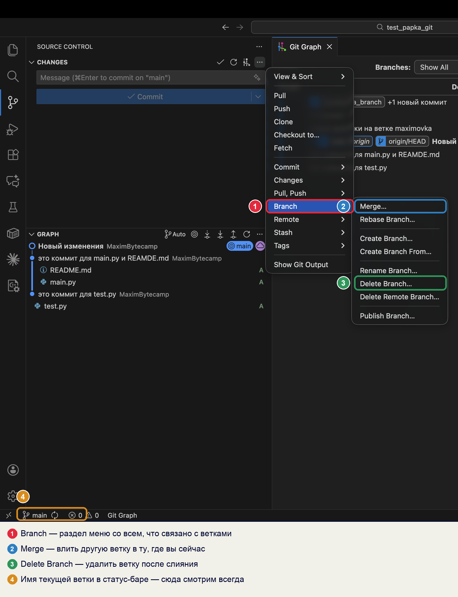

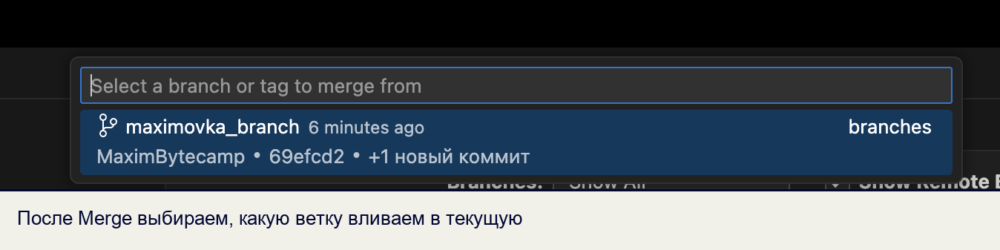

После слияния в `main` появляются и файлы, и все коммиты из ветки. Остаётся
отправить изменения на GitHub кнопкой **Sync Changes**.

> В терминале: `git switch main` → `git merge имя-ветки`

### Удалить отработавшую ветку

Когда функция готова и влита, ветка больше не нужна. Удаляют её, находясь
в `main`. В графе она останется — видно, что работа велась отдельно и потом
влилась в основную линию.

> В терминале: `git branch -d имя-ветки`

---

## 6. Ветки на GitHub и Pull Request

Пока вы не нажали **Publish Branch**, ветка существует только у вас
на компьютере. На GitHub её нет — там по-прежнему одна `main`.

Публиковать ветку нужно, когда с ней работает кто-то ещё, когда вы хотите
показать её преподавателю или сдать задание. Для локальных экспериментов
это не обязательно.

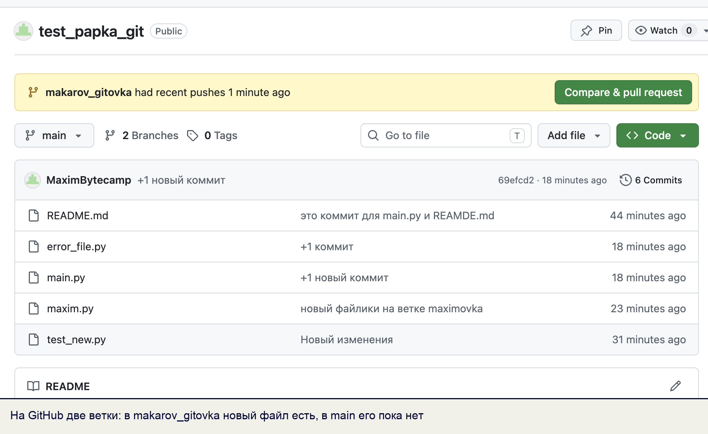

После публикации и первого коммита GitHub сам предложит оформить изменения:

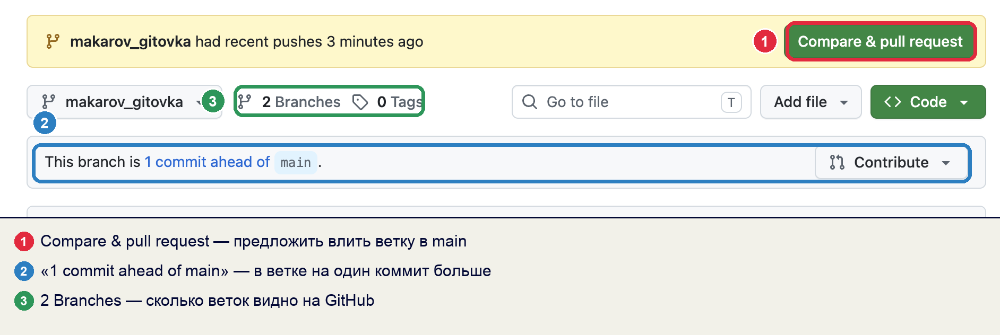

**Pull Request** — это предложение влить вашу ветку в `main` с описанием,
что и зачем сделано. Его можно обсудить, оставить замечания и только потом
принять. Именно так работают в командах: изменения попадают в основную
ветку не молча, а через обсуждение.

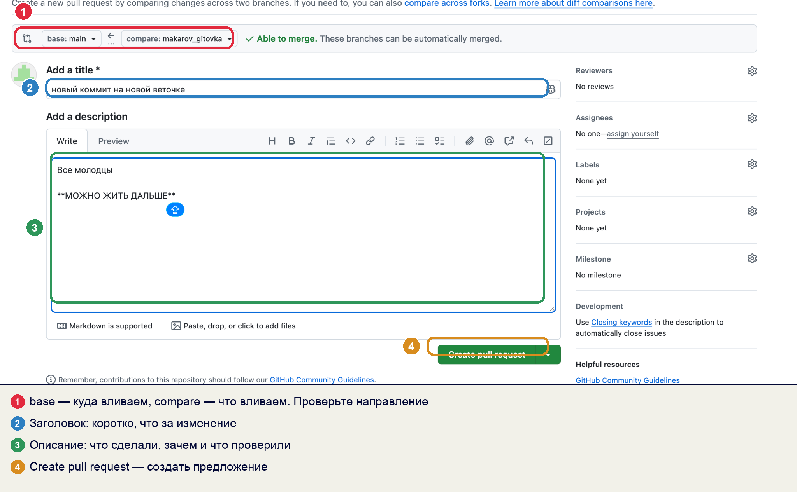

Порядок: `Compare & pull request` → заполнить описание → `Create pull
request` → `Merge pull request` → `Confirm merge`.

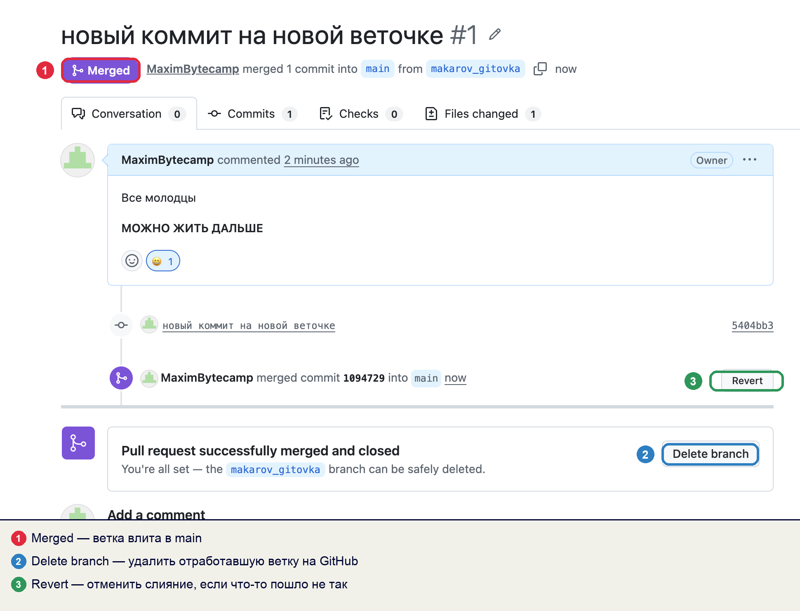

После слияния GitHub предложит удалить ветку — соглашайтесь, она своё
отработала.

Дальше **вернитесь в VS Code и нажмите Sync Changes**: у вас на компьютере
`main` ещё старая, изменения пока только на сайте.

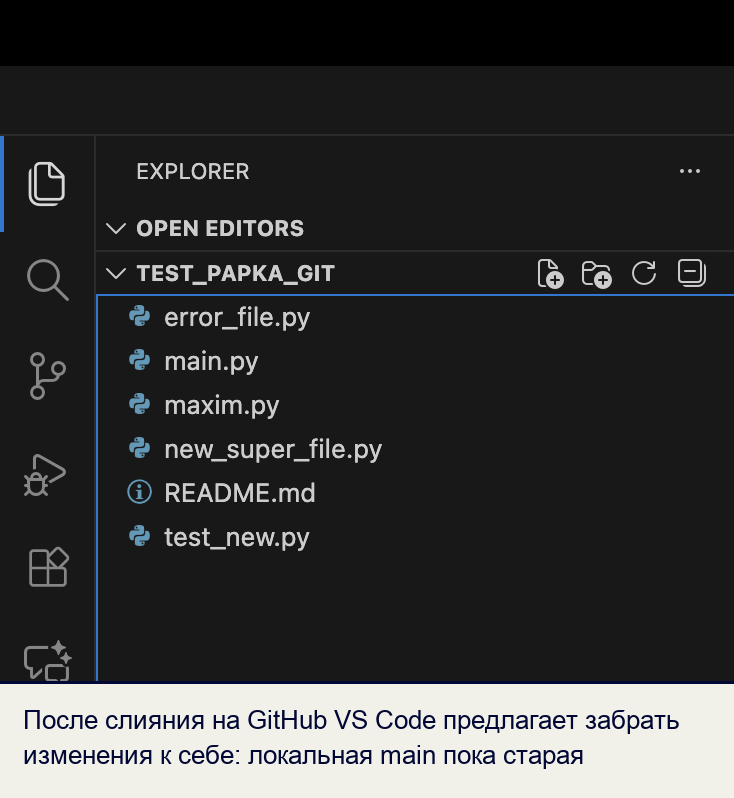

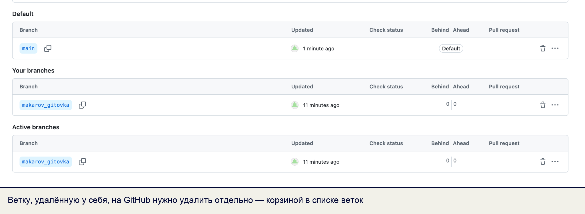

> Git и GitHub — разные вещи. Удалили ветку локально — на GitHub она
> осталась, и наоборот. Удалять нужно в обоих местах.

---

## 7. Конфликты

Конфликт возникает, когда две ветки изменили **одну и ту же строку**
по-разному. Git не угадывает, чья версия правильная, и останавливается,
чтобы решили вы.

Никакой поломки при этом не происходит: файлы целы, просто слияние
поставлено на паузу.

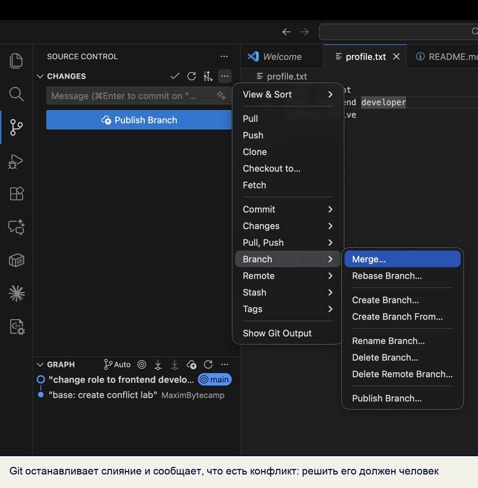

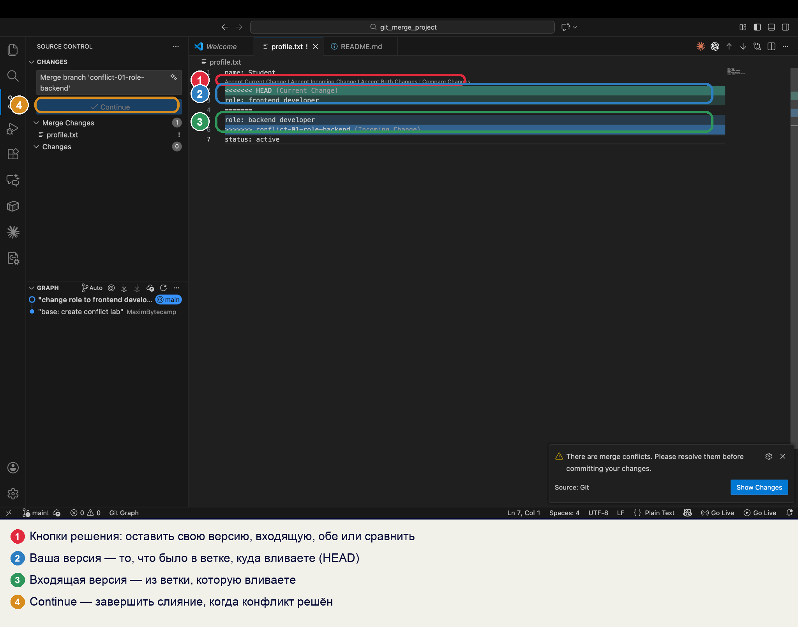

В файле появляются служебные маркеры:

```
<<<<<<< HEAD
role: frontend developer      ← ваша версия, из ветки, где вы находитесь
=======
role: backend developer       ← входящая, из ветки, которую вливаете
>>>>>>> conflict-01-role-backend
```

Над конфликтом VS Code показывает четыре кнопки:

| Кнопка | Что делает |
|---|---|
| Accept Current Change | оставить свою версию |
| Accept Incoming Change | оставить входящую |
| Accept Both Changes | оставить обе строки |
| Compare Changes | открыть сравнение, если непонятно, что поменялось |

Выбираете, проверяете, что в файле не осталось `<<<<<<<` и `>>>>>>>`,
сохраняете — и нажимаете **Continue**. Слияние завершится обычным коммитом.

---

## 8. Совместная работа: pull и fetch

Пока вы работали, кто-то другой (или вы сами с другого компьютера) мог
изменить репозиторий на GitHub. Прежде чем отправлять своё, нужно забрать
чужое.

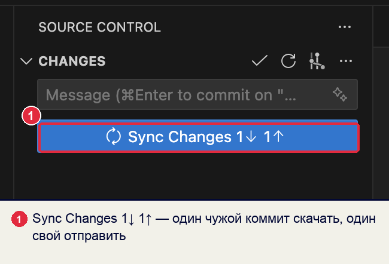

Стрелки на кнопке говорят всё: `1↓` — один чужой коммит нужно скачать,
`1↑` — один свой отправить.

### Если ветки разошлись

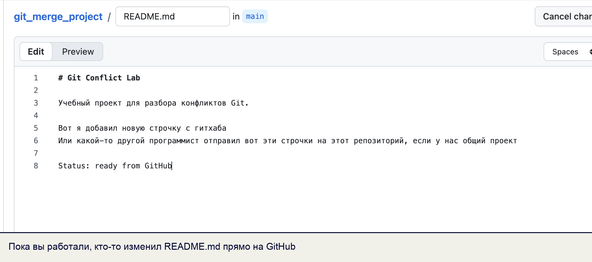

Вы поменяли `README.md` у себя, а кто-то другой — на GitHub. При попытке
синхронизации VS Code сообщит об ошибке: ветки разошлись.

Порядок разбора:

1. Сначала **забрать** чужие изменения (`Pull`), а не отправлять свои.
2. Если git не может объединить их сам — вы получите обычный конфликт
   и разрешаете его, как в разделе 7.
3. Сохраняете, коммитите слияние и только теперь отправляете всё вместе.

Если непонятно, что произошло, откройте **Show Command Output** — там
написан текст ошибки от git, а не общая фраза VS Code.

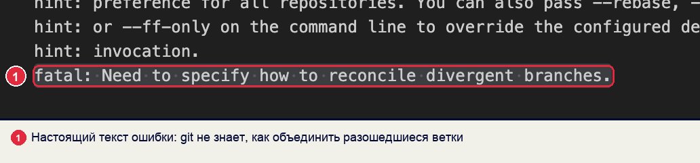

### fetch и pull — разные вещи

- **fetch** — посмотреть, что нового на GitHub. Скачивает информацию
  о коммитах, но ваши файлы не трогает: можно спокойно изучить, что
  изменилось, и решить, нужно ли оно вам.
- **pull** — забрать эти изменения в проект. Файлы обновятся.

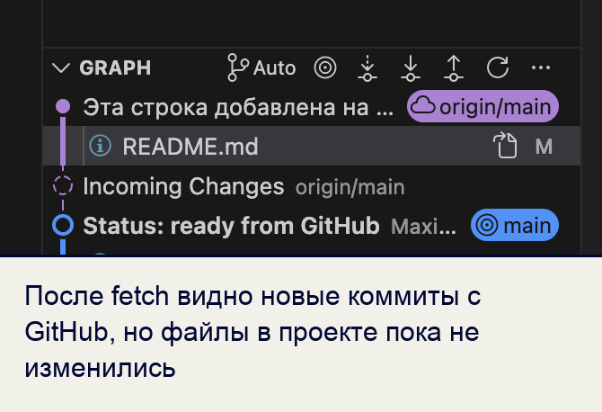

В командной работе привычка такая: `git fetch` → `git status` → и только
потом `git pull`.

---

## 9. Служебные файлы

### .gitignore

Список того, что git не должен отслеживать. Нужен, чтобы в репозиторий
не попадали временные файлы, виртуальные окружения, кэш и — главное —
**пароли и токены**.

```gitignore
# Python
.venv/
__pycache__/
*.pyc
.env

# системное и редакторы
.DS_Store
.vscode/
.idea/
```

Важно: если файл **уже** попал в git, добавить его в `.gitignore` мало —
git продолжит его отслеживать. Нужно убрать его из индекса:

```bash
git rm --cached .env
```

### .gitkeep

Git хранит файлы, а не папки: пустую папку он просто не заметит. Если
структура важна (например, нужна папка `logs/`), внутрь кладут пустой файл
`.gitkeep`. Это не команда git, а договорённость между разработчиками —
имя может быть любым, просто это прижилось.

### README.md

Файл, который GitHub показывает на главной странице репозитория. Обычно
в нём: название проекта, короткое описание, как запустить, что умеет
и кто автор. Пишется на Markdown — том же формате, что и этот документ.

```markdown
# Название проекта

Краткое описание.

## Запуск

    python main.py
```

| Файл | Зачем |
|---|---|
| `.gitignore` | не пускает в репозиторий мусор и секреты |
| `.gitkeep` | сохраняет пустую папку |
| `README.md` | описывает проект на GitHub |

---

## 10. Коммиты с помощью ИИ

В VS Code рядом с полем сообщения есть значок с искрами: он читает
подготовленные изменения и сам предлагает текст коммита.

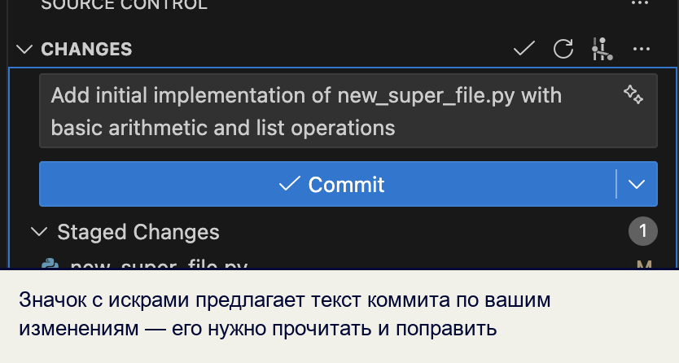

Пользоваться удобно, но правило то же, что и с кодом: **прочитайте, что
он написал**. Модель видит только diff и не знает, зачем вы это делали, —
поэтому «обновил файл» она напишет там, где нужно «fix: пустой список
больше не роняет /orders».

Чтобы сообщения были на русском, откройте настройки
(<kbd>Cmd/Ctrl</kbd> + <kbd>Shift</kbd> + <kbd>P</kbd> → *Open User
Settings (JSON)*) и добавьте:

```json
"github.copilot.chat.commitMessageGeneration.instructions": [
  {
    "text": "Пиши сообщения коммитов на русском языке. Если используешь Conventional Commits, оставляй тип на английском: feat, fix, docs, refactor, test, chore."
  }
]
```

Если в файле уже что-то есть — не забудьте запятую перед вставкой.

---

## Шпаргалка: кнопка ↔ команда

| В VS Code | В терминале | Что делает |
|---|---|---|
| Clone Repository | `git clone <адрес>` | забрать проект с историей |
| Initialize Repository | `git init` | начать следить за папкой |
| `+` у файла | `git add файл` | отобрать файл в коммит |
| `+` у строки Changes | `git add .` | отобрать все изменения |
| Commit | `git commit -m "..."` | сохранить снимок в историю |
| Publish Branch | `git push -u origin main` | отправить ветку на GitHub |
| Sync Changes | `git pull` + `git push` | обменяться изменениями |
| Клик по имени ветки → Create new branch | `git switch -c имя` | создать ветку и перейти в неё |
| Клик по имени ветки → выбрать другую | `git switch main` | переключиться |
| Branch → Merge | `git merge имя` | влить ветку в текущую |
| Branch → Delete Branch | `git branch -d имя` | удалить отработавшую ветку |
| Pull | `git pull` | забрать чужие изменения |
| Fetch | `git fetch` | посмотреть, что нового, не трогая файлы |
| Git Graph | `git log --oneline --graph` | история и ветки |

---

*Разбор основан на материалах Макарова М. Н. Скриншоты авторские, разметка
и пояснения добавлены для учебного пособия.*
