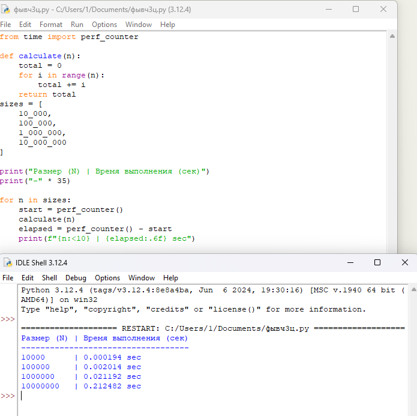
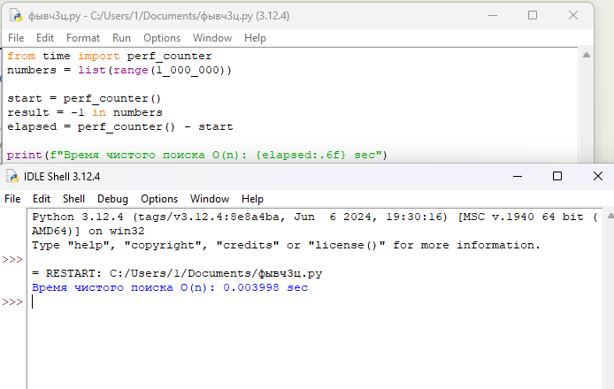

# Домашнее задание № 3 · Замеры времени выполнения и использования памяти
**Студент:** Стружинский А.С
**Группа:**  РПО-11

Срок — до начала занятия 5.

## Компьютер и версия Python:
Windows 10/11, Python 3.12.4

---

## Пример 1. 03_growth_experiment.py
**Скриншот:** 

**Что измерялось:** 
Время выполнения функции циклического суммирования `calculate(n)` при последовательном увеличении объёма входных данных (\(N\)) в 10 раз: от 10 000 до 10 000 000.

**Результат:**
* N = 10 000: 0.000194 sec
* N = 100 000: 0.002014 sec
* N = 1 000 000: 0.021192 sec
* N = 10 000 000: 0.212482 sec

**Вывод:**
Эксперимент наглядно подтверждает теоретическую линейную сложность алгоритма \(O(n)\). При увеличении входного параметра \(N\) ровно в 10 раз время работы программы пропорционально увеличивается также примерно в 10 раз на каждом шаге.

---

## Пример 2. boundary_search_only.py
**Скриншот:** 

**Что измерялось:** 
Чистое время выполнения операции поиска элемента `-1` в списке из 1 000 000 элементов, исключая из замера накладные расходы на создание самого списка.

**Результат:**
Время чистого поиска O(n): 0.003998 sec

**Вывод:**
Для получения точных бенчмарков необходимо изолировать целевую операцию, вынося подготовку данных за рамки таймера `perf_counter()`. Это позволяет измерить чистую скорость алгоритма поиска без примеси тяжелых системных процессов выделения оперативной памяти под массив.

---

## Пример 3. 04_constant_access.py
**Скриншот:** 

**Что измерялось:** 
Скорость прямого доступа к элементу списка по его индексу `len(numbers) // 2` при масштабировании размера списка от 1 000 до 1 000 000 элементов.

**Результат:**
* Размер 1 000: 0.00000260 sec
* Размер 100 000: 0.00000170 sec
* Размер 1 000 000: 0.00000270 sec

**Вывод:**
Результаты тестов подтверждают константную временную сложность \(O(1)\) для операции чтения из списка по индексу. Время выполнения операции исчисляется миллионными долями секунды и не зависит от размера коллекции, оставаясь стабильным как для маленького, так и для огромного списка.
